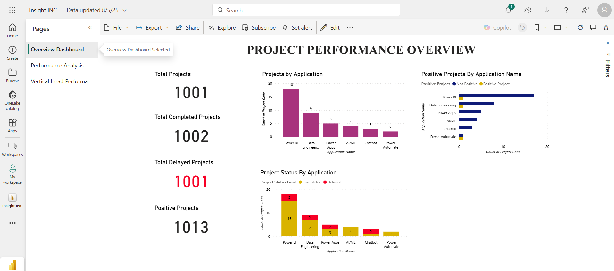

# Insights INC – Project Performance Dashboard (Power BI)

## Project Overview
In this project, I developed a Power BI dashboard to analyze the internal project performance of Insights INC.  
The raw Excel data contained project timelines, statuses, and vertical head details, which required cleaning and transformation to identify delays, monitor WIP project aging, and evaluate vertical head performance.  
The final dashboard provides actionable insights for leadership to track delayed projects, analyze performance, and make informed decisions.

## Key Steps

1. **Data Import**  
   - Loaded project data from Excel into Power BI Desktop  

2. **Data Cleaning**  
   - Removed duplicates  
   - Handled missing values  
   - Standardized date formats & project status labels  

3. **Data Transformation**  
   - Created calculated columns for variance  
   - Created WIP project aging buckets  

4. **Dashboard Creation & Validation**  
   - Designed a multi-page dashboard (Overview, Performance Analysis, Vertical Head Performance)  
   - Verified KPIs: Delayed Projects, WIP Aging, Positive Projects

## Tools & Skills
   - Power BI Desktop : Data Modeling, Dashboards  
   - Excel : Source data cleaning  
   - DAX : Variance calculations, Aging Buckets, KPI logic

## Outcome
| Overview Dashboard | Performance Analysis |
|-------------------|----------------------|
|  |  |

| Vertical Head Performance |
|---------------------------|
|  |

---
